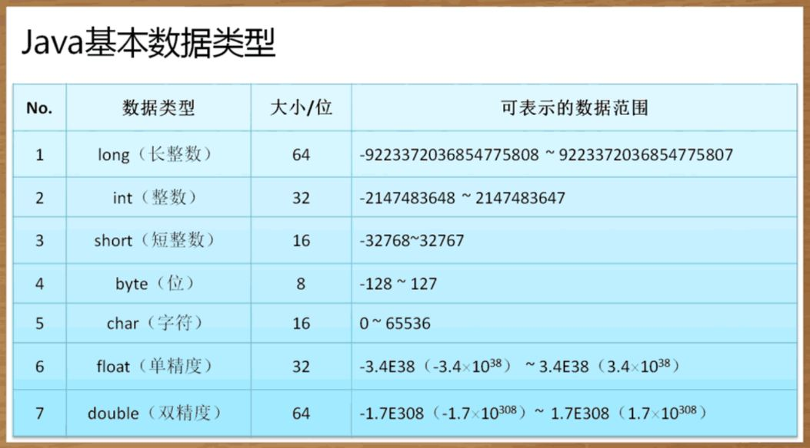

## 数据类型的划分

### 数据分类
- 基本数据类型
    - 数值型
        - 整型：byte short int long;   默认值：0
        - 浮点型：float double;     默认值：0.0
    - 布尔型： boolean;     默认值：false
    - 字符型： char;        默认值：'\u0000'
    
- 引用数据类型：牵扯到内存关系的使用
    - 数组、类、接口   默认值：null

### 使用参考
- 如果要是描述数字首选的一定是int（整型）、double（小数）; 注意定义id依据表的大小定义类型
- 如果要进行数据传输或者是进行文字编码转换使用byte（二进制处理操作）
- 处理中文的时候最方便的操作使用的是字符型char
- 描述内存或者文件大小，描述表的主键列（自增）可以使用long

