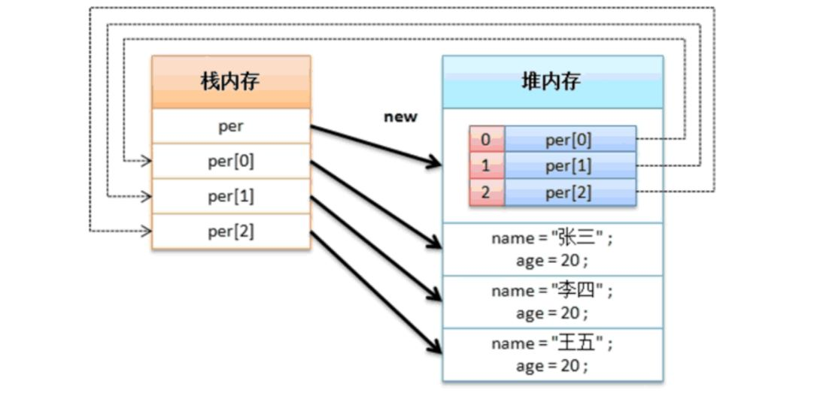

## 数组的定义与使用

### 数组的基本概念
- 数组的动态初始化
    - 数据类型 数组名 [] = new 数据类型 [长度]
    - 数据类型 [] 数组名 = new 数据类型 [长度]

- 数组静态初始化
    - 简化格式： 数据类型 数组名 [] = {数据1, 数据2, ...}
    - 完整格式： 数据类型 数组名 [] = new 数据类型 [] {数据1, 数据2, ...}
    
- 数组长度： 数组名.length

### 数组的应用传递

### 数组的相关操作方法
- 数组排序：java.util.Arrays.sort(数组名)
- 数组拷贝：System.arraycopy(源数组, 源数组开始索引, 目标数组, 目标数组开始索引, 长度)

### 方法可变参数

### 对象数组（重点）
- 动态初始化：类 对象数组名 [] = new 类 [长度]     // 每一个元素内容都是null
- 静态初始化：类 对象数组名 [] = new 类 [] {实例化对象1, 实例化对象2, ...}

- 说明：所有的开发都离不开对象数组，在数组中有一个最大缺陷，即长度是固定的，所以一般会使用特殊处理后的数组；优势是数据是线性保存，通过索引访问速度快（时间复杂度为1）
