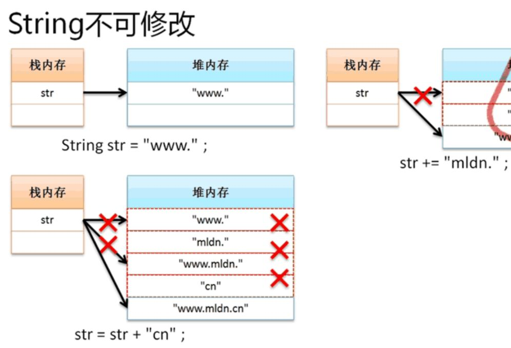
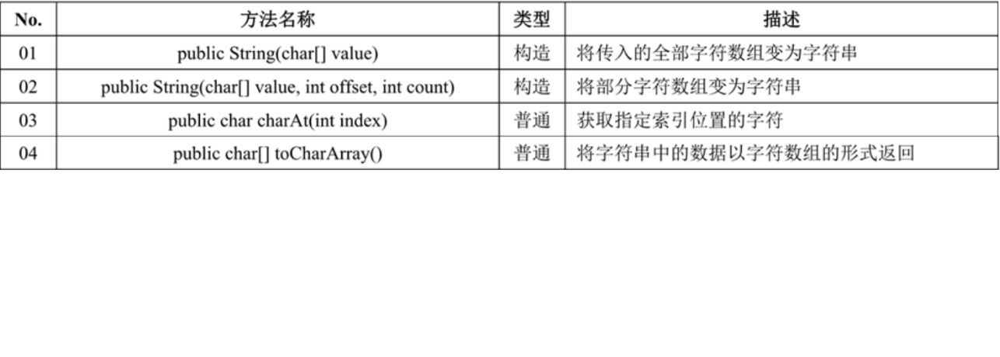
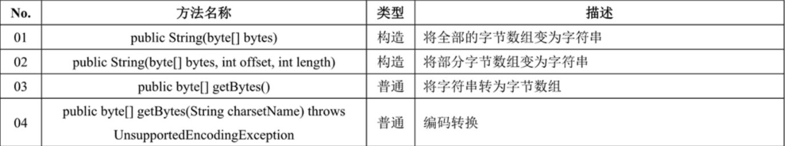
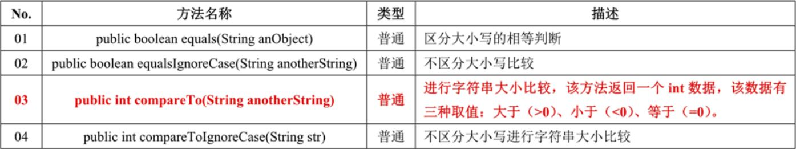
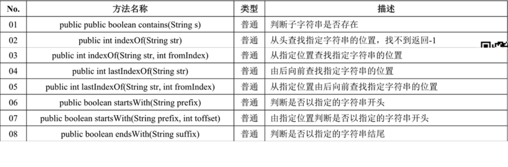
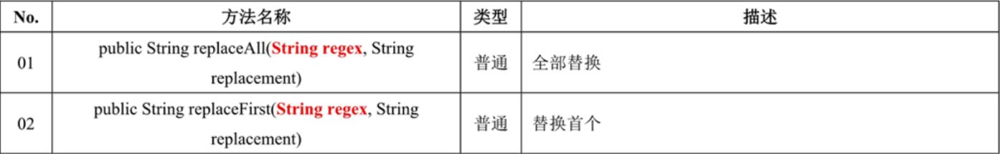
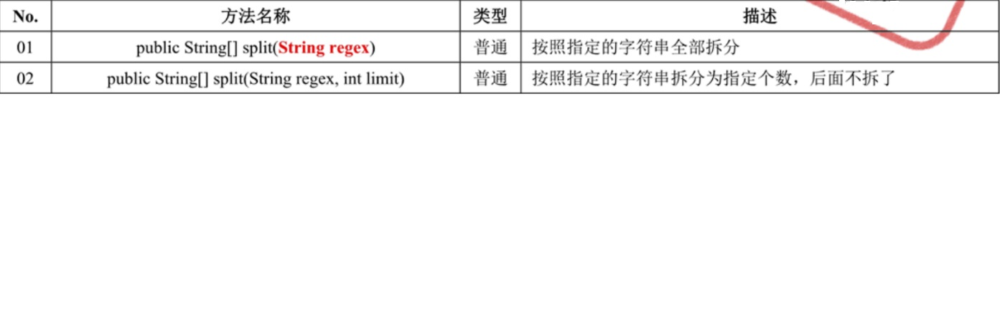
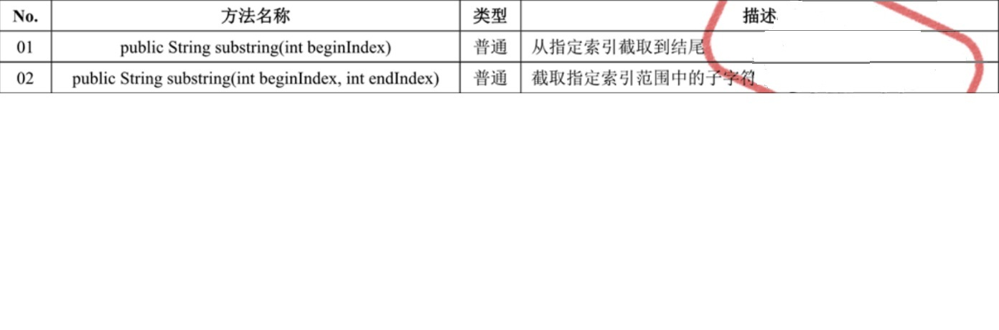
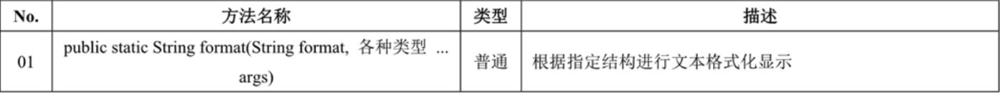
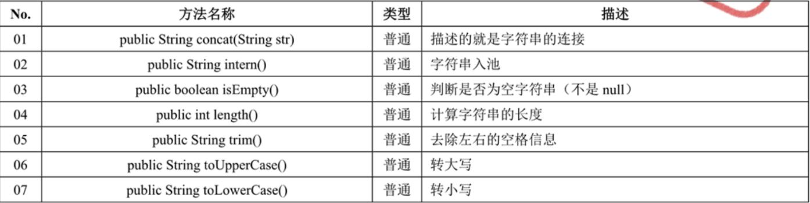

## String

### 字符串比较
- 可以使用“==”来比较，只是不准确: 原理是通过内存地址来比较的
    ```
    publuc class Demo {
        public static void main(String args[]) {
            String a = "abc";
            String b = new String("abc");
            
            System.out.print(a==b); //false
        }
    }
    ```
- 利用equals()：
    ```
    // public boolean equals​(Object anObject)
    // 用法
    String a = "abc";
    String b = new String("abc");
    a.equals(b); // true
    ```
- 判断小技巧
    ```
    // 1.会引发NullPointerException
    String a = null;
    a.equals("abc");
    
    // 2.正确的使用方式
    String a = null;
    "abc".equals(a)
    ```

### 字符串常量是String类的匿名对象
```
String a = "abc"
// "abc" 是一个匿名对象，String a通过引用方式指向"abc"
// 判定"abc"是个匿名对象: "abc"能够调用equals()方法，说明它是一个对象
"abc".equals(a); //true
```

### 字符串池
```
String a = "abc";
String b = "abc";

a == b; //true, 指向的是同一个内存地址
```

### String对象（常量）池
- 静态常量池：指的是程序（.class）在加载的时候会自动将此程序中保存的字符串、普通的常量、类和方法等等，全部进行分配
    ```
    String a = "abc";
    String b = "a" + "b" + "c";
    
    a == b; //true
    ```
- 运行时常量池：当一个程序（.class）加载之后，里面可以有一些变量，这个时候提供的常量池
    ```
    String a = "abc";
    String c = "c";
    String b = "ab" + c;
    
    a == b; //false
    ```
    
### 字符串内容不可修改
在整个的处理过程之中，字符串常量的内容并没有发生任何的改变，改变的只是一个String类对象的引用，并且这种改变将有可能带来大量的垃圾


### String常用方法
- 字符串与字符数组


- 字符串与字节数组：进行二进制的数据传输或者进行编码转换


- 字符串比较：equals是大小写区分的，处了equals还有其他很多比较的方法


- 字符串查找


- 字符串替换


- 字符串拆分


- 字符串截取


- 字符串格式化


- 字符串其他方法
