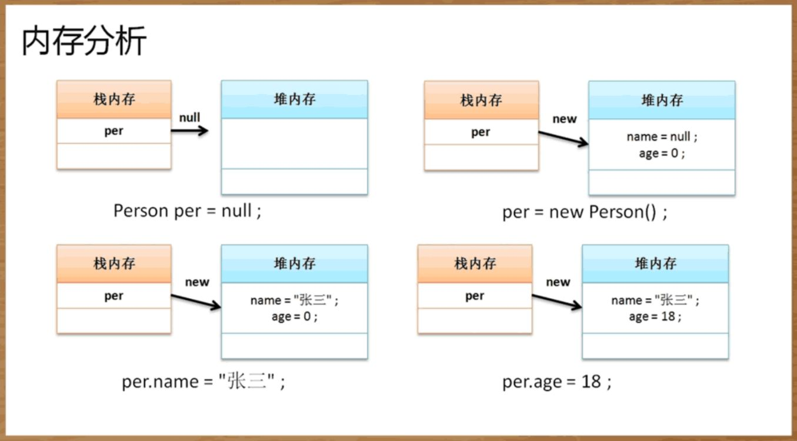
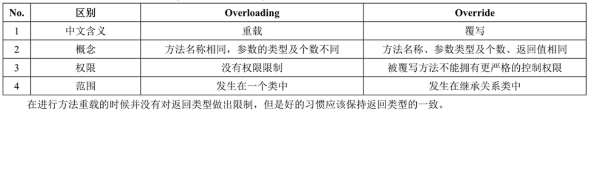

## 类与对象

### Java中的主方法
```
public static void main(String args[]) {}
```
- public：描述的是一种访问权限，主方法是一切的开始点，开始点一定是公共的
- static：程序的执行是通过类名完成的，所有表示此方法是通过类直接调用的
- void：主方法是一切的起点，一旦开始就没有返回的可能
- main：是系统定义好的方法名
- String agrs[]：字符串的数组，可以实现程序启动参数的接收

### 对象实例化操作分析
- 堆内存：保存的是对象的具体信息，在程序之中堆内存空空的开辟是通过new完成的
- 栈内存：保存的是一块堆内存地址，即：通过地址找到堆内存，而后找到对象内容



### 构造方法
- 必须与类名称保持一致
- 不允许设置任何返回值类型，即：没有返回值
- 是在使用关键字new实例化对象的时候自动调用的
- 至少有一个构造方法，如果没有定义，系统会自动提供一个无参的构造方法
- 是允许重载的

### this关键字（注意与super的区别）
- 当前类的属性： this.属性名
- 当前类中的方法： 构造方法 - this(); 普通方法 - this.方法名()
- 描述当前对象

### static关键字
- 可以直接由类名称调用，不需要实例化对象
- static方法只允许调用static属性或方法
- 非static方法允许调用static属性或方法
- 在进行类设计的时候首先考虑非static属性，只要需要公共信息存储时才使用static属性
- 只有在回避实例化对象调用并且描述公共属性的情况下在考虑static定义

### 代码块
- 普通代码块：在一个方法中进行一些结构拆分，防止相同的变量名称所带来的相互影响
    ```
    class A {
        public void fun() {
            {   //普通代码块
                x = 10;
            }
            
            x = 100;
            y = 200;
        }
    }
    ```
- 构造代码块：优先于构造方法执行
    ```
    class A {
        public A() {}
        
        {
            System.out.println("构造代码块");
        }
    }
    ```
- 静态代码块：使用static定义的代码块，包括主类静态代码块和非主类静态代码块
    - 非主类静态代码块：优先于构造代码块执行，不管有多少个实例化对象只会执行一次；主要目的是为了类中静态属性的初始化
        ```
        class A {
            public A() {}
            
            static {
                System.out.println("非主类静态代码块");
            }
            
            {
                System.out.println("构造代码块");
            }
        }
        ```
    
    - 主类静态代码块：优先于主方法执行
        ```
        public class Demo {
            public static void main(String args){}
            
            static {
                System.out.println("主类静态代码块");
            }
        }
        ```

### 什么情况下会考虑使用static方法
在类之中不提供有任何成员属性的情况下，
如果定义的是普通方法，
那么就必须通过实例化对象来进行调用，
而这样就会产生许多无用的实例化对象，
那么多在这样的情况下会考虑直接定义static方法，
这样可以直接使用类名调用而无需实例化

### 继承（extend）
- super(): 在子类明确调用父类构造方法，只允许放在子类构造方法的首行

- 相关限制
    - 只允许多层继承，不允许多重继承
        ```
        // 多重：这是不被允许的
        class C extend A, B {}
        // 多层：这是允许的
        class B extend A {}
        class C extend B {}
        ```
    - 在继承关系定义的时候，实际上子类是可以继承父类中所有的操作结构；但是对于私有操作属于隐式继承

### 覆写
- 定义：子类方法名和参数与父类完全一样
- 子类调用父类方法用：super.父类方法名()
- 限制：被覆写的方法不能有比父类方法更为严格的访问控制权限（public > default >　private）; 即：如果父类方法定义default，那么子类只能是public或者default
- 属性也是可以覆写的，只是子类属性覆写后，该属性与父类没什么关系了，相当于子类定义了一个新的属性

### Override与Overloading的区别


### super与this的区别
- 在程序类中使用this表示从本类中查找所需要的属性或方法，如果本类不存在则查找父类中的类定义；super则直接在父类定义中查找
- this和super都可以进行构造方法的调用，但是this()调用的是本类构造方法，而super()是调用父类构造；两个语句都放房子构造方法的首行，所以不能同时出现
- this可以表示当前对象

### final关键字
- final在程序之中描述的是种终结器，可以实现以下功能：定义不能够被继承的类，定义不能被覆写的方法、表示常量
- 重要作用：定义全局常量，一旦定义不可修改
    ```
    public static final int ON = 1;
    public static final int OFF = 0;
    ```
