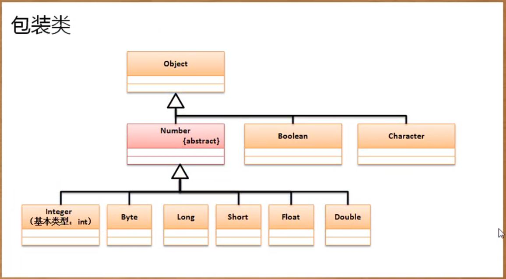
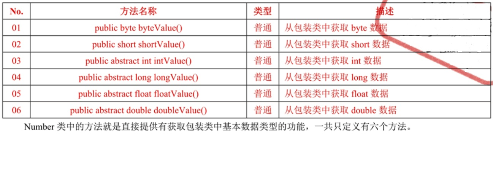

## 包装类
Object类是所有类的父类，并且可以接受所有数据类型。但基本数据类型不是类，如果要想将基本数据类型以类的方式进行处理，就要对其进行包装

### 包装类的类型
- 对象型包装类（Object直接子类）：Boolean Character
- 数值型包装类（Number直接子类）：Byte Short Integer Long Double Float

### 装箱与拆箱
基本数据类型的包装类都是为了基本数据类型转为对象提供的，这样对于基本数据类型与包装类之间就有了如下操作关系
- 数据装箱：将基本数据类型保存到包装类中，一般可以利用构造方法完成
    - Integer类：public Integer(int value)
    - Double：public Double(double value)
    - Boolean类：public Boolean类(boolean类 value)
- 数据拆箱：从包装类中获取基本数据类型
    - 数值型包装类已经有Number类定义类拆箱方法
    - Boolean型：public boolean booleanValue()
    
### 包装类的相等判断
一定要使用equals。包装类本身也需要考虑占位的长度，如果超过了一位的内容就要使用equals,如果不超过则可以使用“==”判断

### 数据类型转换
用户输入的类型之一一种：String型，此时就需要就行数据类型转换了
- Integer类：public static int parseInt(String str)
- Double：public static Double parseDouble(String str)
- Boolean：public static Boolean parseBoolean(String str)