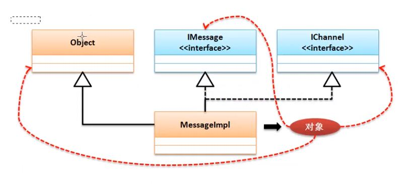
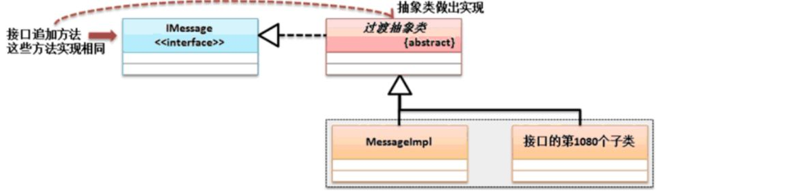
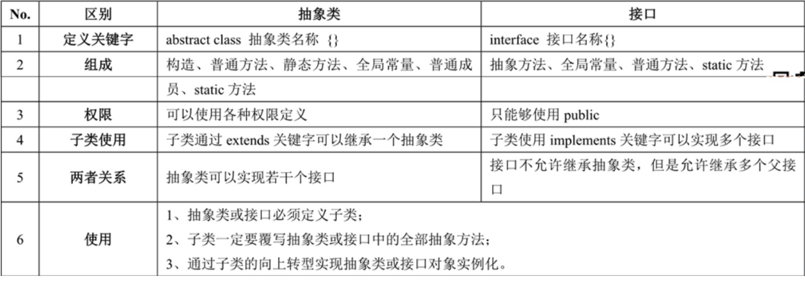

## 接口
interface

### 接口基本定义
- 接口需要被子类实现（implement），一个子类可以实现多个父接口
- 子类（不是抽象类）一定要覆写接口的全部抽象方法
- 接口对象可以利用子类对象的向上转型进行实例化


### 接口的使用形式
- 进行标准设置
- 表示一种操作能力
- 暴露远程方法视图，这个一般在RPC分布式开发中使用

### 接口结构设计


### 抽象类与接口区别


### 加强版接口（一般不使用下列用法）
- 可以定义普通方法：必须追加default
    ```
    interface IMessage {
        public String message() ;
        // 方法是一个公共方法，都具备
        public default boolean connect() {
            System.out.println("建立消息的发送通道。") ;
            return true ;
        }
     }
    ```
- 可以定义static方法，可以通过接口直接调用
```
interface IMessage {
	public String message() ;
	// 方法是一个公共方法，都具备
	public default boolean connect() {
		System.out.println("建立消息的发送通道。") ;
		return true ;
	}
	public static IMessage getInstance() {
		// 获得子类对象
		return new MessageImpl() ;	
	}
}
class MessageImpl implements IMessage {
	public String message() {
		if (this.connect()) {
			return "www.mldn.cn" ;
		}
		return "没有消息发送。" ;
	}
}
public class JavaDemo {
	public static void main(String args[]) {
		IMessage msg = IMessage.getInstance() ;
		System.out.println(msg.message()) ;
	}
} 
```