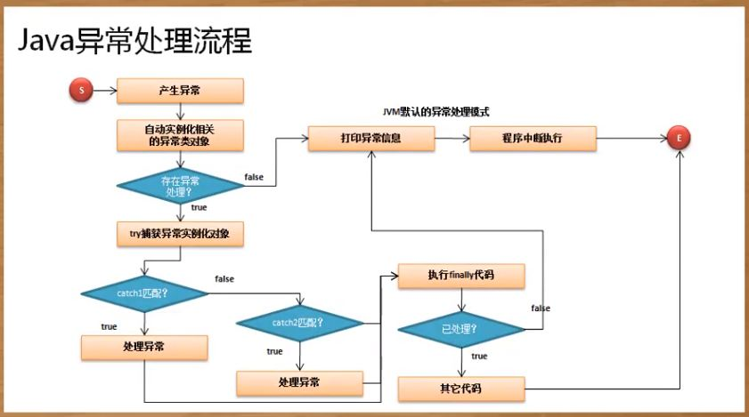

## 异常处理

### 处理异常
```
try{

}catch(异常类型 异常对象){

}catch(异常类型 异常对象){

}catch(Exception e){
    // 捕获所有的异常
    e.printStrackTrace();
}finally{
    // 不管异常是否处理都执行
}
```

### 异常处理流程



### throws关键字
如果定义了一个方法，实际上就应该明确的告诉使用者，这个方法可能产生何种异常，那么此时就使用throws来标注
```
class MyMath {
	// 这个代码执行的时候可能会产生异常，如果产生异常调用处理
	public static int div(int x,int y) throws Exception {
		return x / y ;
	}
}
public class JavaDemo {
	public static void main(String args[]) {
		try {
			System.out.println(MyMath.div(10,0)) ;
		} catch (Exception e) {
			e.printStackTrace() ;
		}
	}
} 
```

### throw关键字
向上抛出异常
```
class MyMath {
	// 异常交给被调用处处理则一定要在方法上使用throws
	public static int div(int x,int y) throws Exception {
		int temp = 0 ;
		System.out.println("*** 【START】除法计算开始。") ;
		try {
			temp = x / y ;
		} catch (Exception e) {
			throw e ; // 向上抛异常对象
		} finally {
			System.out.println("*** 【END】除法计算结束。") ;
		}
		return temp ;
	}
}
public class JavaDemo {
	public static void main(String args[]) {
		try {
			System.out.println(MyMath.div(10,0)) ;
		} catch (Exception e) {
			e.printStackTrace() ;
		}
	}
}
```

### throws与throw区别
- throw：是在代码块中使用的，主要是手工进行异常的抛出
- throws：是在方法定义上使用的，表示此方法可能产生异常明确告诉给调用处，由调用处进行处理


### RuntimeException
此类的异常子类不需要强制处理

### RuntimeException与Exception的区别
- RuntimeException是Exception子类
- RuntimeException可以不需要进行强制处理，Exception必须强制处理
- 常见RuntimeException类：NumberFormatException、ClassCastException、NullPointerException

### 自定义异常类
```
class BombException extends Exception {
	public BombException(String msg) {
		super(msg) ;
	}
}
class Food {
	public static void eat(int num) throws BombException {
		if (num > 10) {
			throw new BombException("1234567890") ;
		} else {
			System.out.println("0987654321") ;
		}
	}
}
public class JavaDemo {
	public static void main(String args[]) throws Exception {
		Food.eat(000000000) ;
	}
}
```


### assert断言

