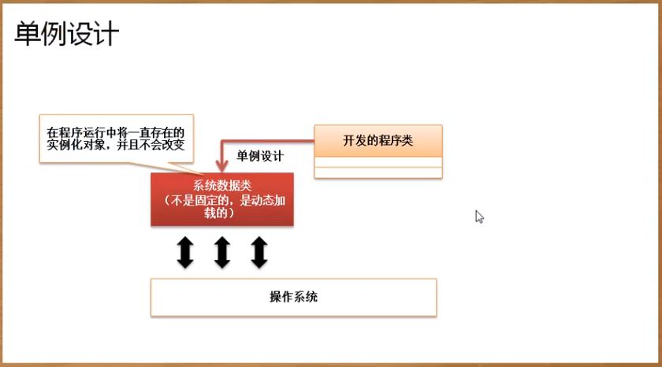

## 单例设计模式

### 初始化加载
```
class Singleton {
	private static final Singleton INSTANCE = new Singleton() ;
	private Singleton() {}	// 构造方法私有化了
	public static Singleton getInstance() {
		return INSTANCE ;
	}
	public void print() {
		System.out.println("www.mldn.cn") ;
	}
}
public class JavaDemo {
	public static void main(String args[]) {
		Singleton instance = null ;	// 声明对象
		instance = Singleton.getInstance();
		instance.print() ;
	}
} 
```

### 使用时加载
```
class Singleton {
	private static Singleton instance ;
	private Singleton() {}	// 构造方法私有化了
	public static Singleton getInstance() {
		if (instance == null) {	// 第一次使用
			instance = new Singleton() ; // 实例化对象
		}
		return instance ;
	}
	public void print() {
		System.out.println("www.mldn.cn") ;
	}
}
public class JavaDemo {
	public static void main(String args[]) {
		Singleton instance = null ;	// 声明对象
		instance = Singleton.getInstance();
		instance.print() ;
	}
}
```