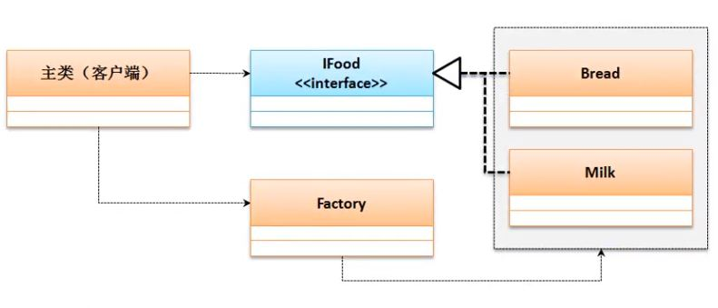

## 工厂设计模式
使用接口设计


```
interface IFood {	// 定义一个食物标准
	public void eat() ; // 吃
}
class Bread implements IFood { // 定义一种食物
	public void eat() {
		System.out.println("吃面包。") ;
	}
}
class Milk implements IFood { // 定义一种食物
	public void eat() {
		System.out.println("喝牛奶。") ;
	}
}
class Factory {
	public static IFood getInstance(String className) {
		if ("bread".equals(className)) {
			return new Bread() ;
		} else if ("milk".equals(className)) {
			return new Milk() ;
		} else {
			return null ;
		}
	}
}
public class JavaDemo {
	public static void main(String args[]) {
		IFood food = Factory.getInstance(args[0]) ;
		food.eat() ;// 吃面包
	}
} 
```